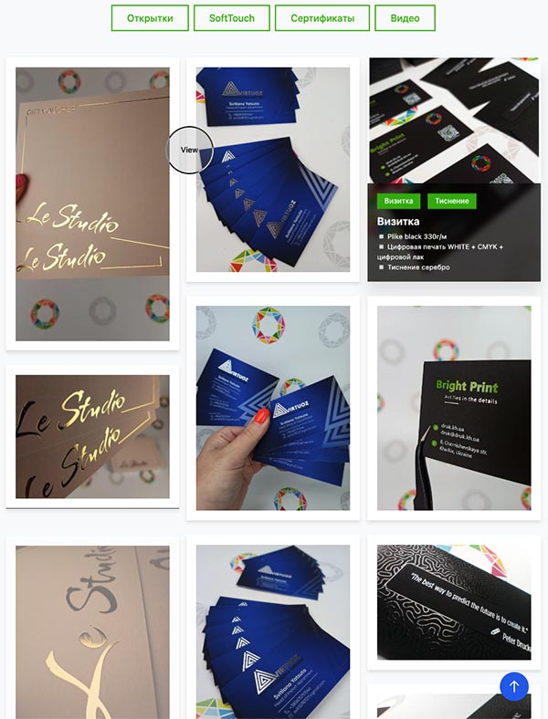
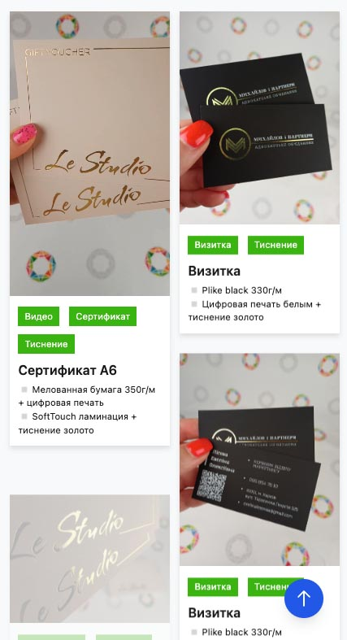

# Bright Print Portfolio Gallery

A responsive portfolio gallery showcasing print production works using a masonry grid layout.

## Features

- Responsive masonry grid layout (1-4 columns based on screen size)
- Filterable content by category (e.g., certificates, foil stamping, videos)
- Lightbox for detailed viewing of images and videos
- Custom cursor with contextual text ("View" for images, "Play" for videos)
- Smooth animations and transitions
- Mobile-friendly design with adapted layout

## Technologies

- HTML5 / CSS3
- JavaScript (ES6+)
- GSAP for animations
- imagesLoaded for optimized image loading
- Responsive design without external frameworks

## Preview

<p align="center">
  
  
</p>

## Usage

### Basic Structure

```html
<div class="masonry">
  <div class="item" data-category="certificate,foil" data-type="image" data-src="path/to/image.jpg">
    <div class="item-zoom-effect relative color-filter">
      
      <div class="item-caption">
        <div class="tag" data-filter="certificate">Certificate</div>
        <div class="tag" data-filter="foil">Foil Stamping</div>
        <h3>Item Title</h3>
        <p>Description details</p>
      </div>
    </div>
  </div>
  <!-- More items... -->
</div>
```

### Filter Buttons

```html
<div class="category-filter">
  <button class="filter-btn active" data-filter="all">All Works</button>
  <button class="filter-btn" data-filter="certificate">Certificates</button>
  <button class="filter-btn" data-filter="foil">Foil Stamping</button>
  <!-- More filter buttons... -->
</div>
```

## Browser Compatibility

- Chrome (latest)
- Firefox (latest)
- Safari (latest)
- Edge (latest)
- iOS Safari (latest)
- Android Chrome (latest)

## Notes

- Videos use the `playsinline` attribute to prevent fullscreen mode on iOS Safari
- For optimal performance, resize and optimize images before using them in the gallery
- The lightbox navigation is keyboard accessible (Arrow Left/Right, Escape key)
